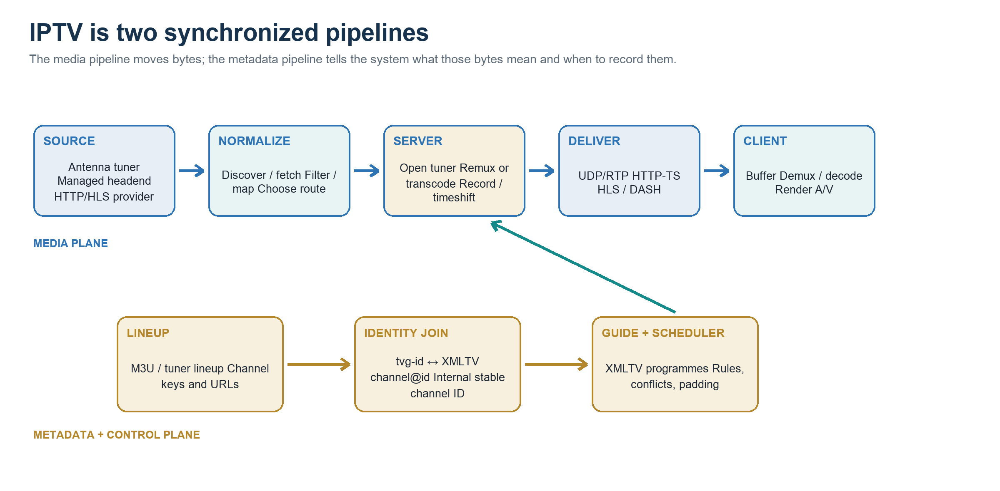
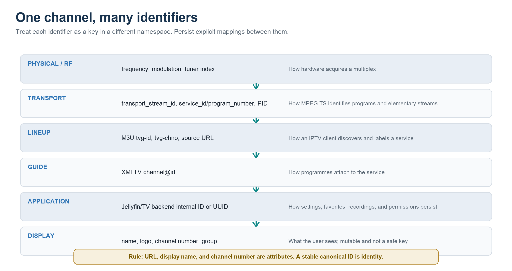
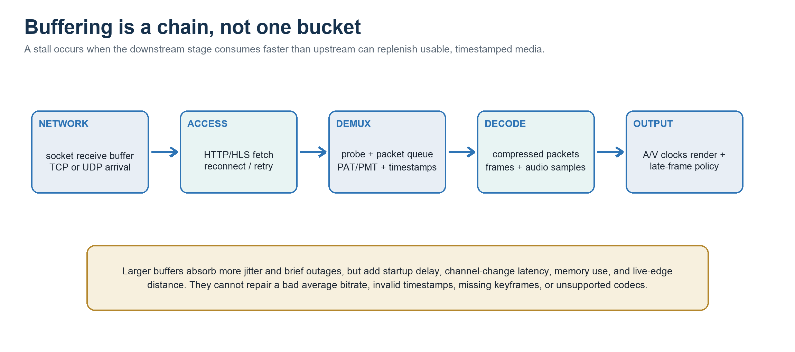
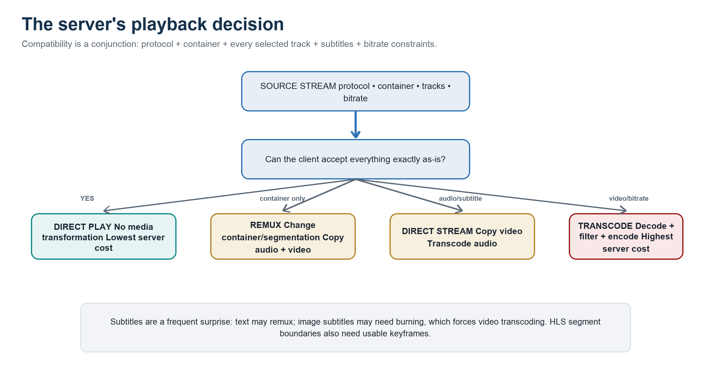

# IPTV, End to End

> How lineups, guide data, tuners, schedules, codecs, players, FFmpeg, VLC, and Jellyfin fit together

| **CONTROL PLANE**<br>Providers • playlists • identity • EPG | **MEDIA PLANE**<br>Protocols • containers • codecs • timing | **OPERATIONS PLANE**<br>Tuners • recording • buffering • health |
| --- | --- | --- |

*A practical reference for builders, operators, and technically curious readers*

*Research edition — 19 August 2026*

## Parsing conventions

- Heading numbers are stable chapter identifiers.
- Claims cite bibliography entries using source IDs such as `[S12]`.
- Command examples use fenced code blocks with language identifiers.
- Tables use their first row as the header row.
- Diagram links use relative paths and include complete descriptive alt text.
- Example credentials, tokens, hostnames, and addresses are placeholders only.

## Guide map

*Use this map to move from signal acquisition to metadata, playback, operations, and troubleshooting. Source markers such as [S12] connect claims to the linked bibliography.*

| Foundations and metadata | Playback, operations, and references |
| --- | --- |
| 0  Executive mental model | 10  VLC playback and buffering |
| 1  What IPTV means | 11  FFmpeg probing, remuxing, and transcoding |
| 2  Sources and provider models | 12  Jellyfin live-TV stream handling |
| 3  Network tuners | 13  Dynamic groups, proxies, and implementation studies |
| 4  Lineups, playlists, and M3U | 14  Reliability and observability |
| 5  XMLTV, EPG, and guide ingestion | 15  Security, rights, and privacy |
| 6  Channel IDs and identity | 16  Reference architecture |
| 7  Scheduling, recording, and time-shift | 17  Troubleshooting playbook |
| 8  Transport protocols | A  Quick-reference tables |
| 9  Containers, codecs, and timestamps | B  Glossary |
|  | C  Sources and further reading |

> **READING PATHS**
>
> New to IPTV? Read 0–12 in order. Building a platform? Focus on 3–9 and 11–16. Debugging an incident? Start with 17, then jump to the subsystem chapter named by the symptom.

## 0. Executive mental model

> IPTV is not one protocol or one product. It is a coordinated system that acquires a live service, names it, attaches schedule metadata, transports compressed media, allocates finite resources, and adapts playback to the receiving device.



*Figure 1. The media plane and metadata/control plane meet at the TV server.*

> **THE SINGLE MOST USEFUL RULE**
>
> Keep four concepts separate: identity (which service?), location (which URL or tuner path now?), presentation (what name/number/logo?), and schedule (what airs when?). Most brittle IPTV systems collapse them into one mutable playlist line.

A channel change is a distributed transaction. The system selects a route, reserves a tuner or provider connection, opens the stream, recognizes its container and tracks, waits for decodable timing and a keyframe, chooses direct play/remux/transcode, fills enough buffer, then renders. The guide can be correct while playback fails, and playback can work while the guide is empty.

*Table 1. A seven-plane model for reasoning about IPTV systems.*

| Plane | Core question | Typical artifacts |
| --- | --- | --- |
| Acquisition | Where do the bytes originate? | RF tuner, provider URL, RTSP session, virtual playout |
| Catalog / identity | Which logical channel is this? | Canonical ID, M3U tvg-id, service ID, internal UUID |
| Guide / schedule | What is on, and what should be recorded? | XMLTV, DVB EIT, ATSC PSIP, rules, padding |
| Transport | How do packets reach the consumer? | UDP/RTP, HTTP-TS, HLS, DASH, SRT |
| Media | How are pictures, sound, subtitles, and clocks represented? | MPEG-TS/fMP4/MKV; H.264/HEVC; AAC/AC-3; PTS/PCR |
| Playback | Can this client consume the result? | Direct play, remux, audio transcode, video transcode |
| Operations | Will it stay reliable? | Health probes, concurrency, logs, metrics, retries, failover |

## 1. What IPTV means - and what it does not

Internet Protocol television means television delivered over IP networks. In a classic telecom deployment, live channels often traverse a managed access network as multicast MPEG transport streams, while on-demand material is unicast. In everyday usage, IPTV also refers to over-the-top live television delivered over the public Internet, most commonly as HTTP unicast and adaptive segments. **[S1]**

The delivery path can be centrally hosted or distributed through edge caches. A headend receives contribution feeds, encodes or passes through audio/video, creates service metadata, applies conditional access where required, and publishes the result to a managed network or CDN. A home server can perform a miniature version of the same job.

*Table 2. Common systems called IPTV.*

| Model | Distribution | Control | Typical client contract |
| --- | --- | --- | --- |
| Managed operator IPTV | Multicast live TV inside an ISP network; unicast VOD | Operator QoS, gateway, set-top box | Provisioned device/session; often closed |
| OTT live streaming | HTTP unicast through CDN | App account, token, DRM/license | HLS or DASH plus application APIs |
| Open/custom IPTV | Direct HTTP, HLS, RTP, RTSP, or local gateway | M3U/XMLTV and local policy | General-purpose player or TV server |
| Network-tuner TV | RF broadcast converted to LAN unicast/multicast | Tuner discovery and reservation | Lineup endpoint or backend API |
| Virtual linear channel | On-demand assets scheduled as a continuous stream | Playout engine + generated EPG | M3U/XMLTV or tuner emulation |

> **TERMINOLOGY TRAP**
>
> A file ending in .m3u8 may be a UTF-8 channel lineup or an HLS playlist. A lineup lists channels; an HLS master lists renditions; an HLS media playlist lists time-ordered segments. Inspect the tags and referenced URLs before assuming what it is. **[S2, S10]**

## 2. Sources and IPTV provider models

A provider integration is a contract around four things: catalog, authorization, stream acquisition, and guide data. Some providers expose all four through one playlist URL. Others expose a lineup and guide separately. App-first services may expose only authenticated, DRM-protected playback through their own application and therefore cannot be represented faithfully by a static M3U file.

*Table 3. Provider/source integration patterns.*

| Source type | What you receive | Operational concerns |
| --- | --- | --- |
| Local broadcast tuner | Antenna/cable/satellite services and in-band metadata | Reception quality, tuner count, multiplex sharing, rescans |
| Paid M3U/XMLTV service | Lineup URL, stream URLs, guide URL | Connection cap, token lifetime, geo/routing, terms and rights |
| Managed operator feed | Multicast groups or provisioned gateway service | VLAN, IGMP, operator authentication, private routing |
| FAST/public stream | Public HLS/HTTP URL and sometimes no EPG | URL churn, regional variants, ad markers, sparse metadata |
| App-only commercial service | App manifest, account session, DRM licenses | No general-purpose M3U; CDM and device policy required |
| Virtual channel engine | Generated M3U/tuner API plus XMLTV | Playout continuity, duration accuracy, transcode normalization |

Provider URLs commonly carry usernames, passwords, bearer tokens, signed query strings, cookies, or device identifiers. Treat a playlist as a secret. Do not commit it, paste it into issue trackers, expose it through an unauthenticated reverse proxy, or let raw URLs enter logs. Stable local aliases can shield downstream clients from token rotation.

Concurrency is a contractual and technical limit. One viewer, one recorder, and one probe can count as three open streams unless a proxy shares an upstream connection. Define exactly what consumes a slot and reserve capacity for scheduled recordings.

> **RIGHTS BOUNDARY**
>
> Use streams and guide data for which you have permission. Publicly reachable is not the same as licensed for redistribution. DRM removal, credential sharing, and restreaming can violate contracts or law. Projects such as iptv-org maintain removal/blocklist processes, but operators remain responsible for their own use. **[S36, S37, S41]**

## 3. Network tuners: bridging RF television onto IP

A network tuner converts a physical broadcast input into an IP-accessible service. The tuner locks a frequency and modulation scheme; a demultiplexer selects one program from the received transport multiplex; a server or client reads the resulting MPEG-TS. Discovery and lineup APIs hide most RF details from media servers.

HDHomeRun-class devices expose device discovery data including tuner count and a lineup URL. Current models can publish virtual-channel lineup data at /lineup.json and stream a virtual channel over HTTP, while lower-level control can direct a tuner to a UDP target. The device is both a scarce resource pool and a source of truth about receivable channels. **[S11, S12]**

### HDHOMERUN DISCOVERY AND STREAM SHAPES

```bash
http://TUNER_IP/discover.json
http://TUNER_IP/lineup.json
http://TUNER_IP:5004/auto/v9.1
 
# Lower-level example from a trusted LAN administration host:
hdhomerun_config discover
hdhomerun_config DEVICE_ID get /tuner0/streaminfo
hdhomerun_config DEVICE_ID set /tuner0/target udp://PLAYER_IP:5000
```

SAT>IP is another remote-tuner pattern, using discovery plus RTSP/HTTP to request services from satellite or other DVB frontends. Tvheadend, NextPVR, and similar backends generalize this further: they own adapters, networks, muxes, services, channels, EPG ingestion, and DVR rules, then expose normalized streams and metadata to clients.

*Table 4. Tuner-side resources and constraints.*

| Resource | Constraint | Design implication |
| --- | --- | --- |
| Frontend/tuner | Can lock one RF tuning configuration at a time | Overlapping channels may require multiple tuners |
| Multiplex | Carries several services on one frequency | A capable backend may share one tuned mux among consumers |
| LAN path | Sustains the aggregate transport bitrate | Use wired Ethernet where possible; isolate multicast intentionally |
| Backend profile | May pass through, remux, or transcode | Browser clients often need a compatible profile |
| Guide source | OTA guide may be shallow or sparse | Blend or replace with licensed XMLTV where appropriate |

For IPv4 multicast, hosts signal group interest through IGMP. Snooping switches use those reports to avoid flooding every LAN port, but a misconfigured querier, snooping bridge, VLAN boundary, or Wi-Fi multicast conversion can make a stream work briefly and then disappear. IGMPv3 now lives in RFC 9776; RFC 4541 remains useful switch guidance. **[S5, S6]**

## 4. Lineups and extended M3U

A lineup answers: which channels exist, how should they be presented, and where can each be opened? Extended M3U is the most common interchange format. It is line-oriented and forgiving, which makes it portable but also creates dialects.

### A PORTABLE CHANNEL-LINEUP ENTRY

```m3u
#EXTM3U x-tvg-url="https://guide.example/denver.xml.gz"
#EXTINF:-1 tvg-id="kusa.denver.example" tvg-name="KUSA" \
  tvg-chno="9.1" tvg-logo="https://img.example/kusa.png" \
  group-title="Local;News",KUSA 9.1
https://edge.example/live/kusa/master.m3u8?token=REDACTED
```

*Table 5. Common IPTV M3U fields and their proper role.*

| Field | Role | Stability guidance |
| --- | --- | --- |
| tvg-id | Join key to XMLTV channel@id by convention | Stable and unique within the guide namespace |
| tvg-name | Human/matcher hint | Useful fallback; not a canonical key |
| tvg-chno | Display/sort number | Can change by region or user preference |
| tvg-logo | Presentation artwork | Cacheable; do not use as identity |
| group-title | One or more categories/groups | A snapshot; syntax and multi-group support vary |
| URL | Current acquisition route | Expect tokens, hosts, or fallback order to change |
| #EXTVLCOPT / #KODIPROP | Player-specific options | Treat as nonportable extensions |

Kodi's IPTV Simple documentation illustrates the real ecosystem: tvg-id, tvg-name, tvg-chno, tvg-logo, group-title, radio, provider metadata, catch-up modes, and player-specific properties. It also shows that some tags are de facto conventions, not one universal M3U standard. Validate against the actual consumer. **[S10]**

Lineup ingestion should be deterministic: fetch with a timeout, verify HTTP status and content type, decode UTF-8 safely, parse into a temporary structure, reject or quarantine malformed entries, resolve duplicates using policy, then atomically replace the active snapshot. Retain the last known good lineup when refresh fails.

> **DO NOT KEY BY URL**
>
> A signed URL may rotate every hour while the logical channel remains unchanged. Store a stable canonical channel ID and versioned route records with health, priority, and expiry metadata.

## 5. XMLTV, EPG data, and time

An electronic program guide is a time-indexed catalog of airings. XMLTV represents it as channel records followed by programme records. A programme's channel attribute must refer to a channel id; its required start and channel attributes say when and where the airing begins. Stop, title, subtitle, description, categories, credits, episode numbering, ratings, images, language, audio/video properties, and repeat status add scheduling and presentation value. **[S8, S9]**

### MINIMAL USEFUL XMLTV

```xml
<?xml version="1.0" encoding="UTF-8"?>
<tv source-info-name="Example Guide" generator-info-name="guide-builder/1.0">
  <channel id="kusa.denver.example">
    <display-name>KUSA 9.1</display-name>
    <icon src="https://img.example/kusa.png"/>
  </channel>
  <programme start="20260820000000 +0000"
             stop="20260820003000 +0000"
             channel="kusa.denver.example">
    <title lang="en">Evening News</title>
    <category lang="en">News</category>
    <episode-num system="onscreen">2026-08-19</episode-num>
    <new/>
  </programme>
</tv>
```

XMLTV time strings are compact ISO-8601-like values. The DTD permits partial precision and says UTC is assumed when no timezone is present, but production systems should emit full timestamps with an explicit numeric offset or normalize to +0000. That removes ambiguity at daylight-saving transitions. Treat programme intervals as half-open: start is included and stop is excluded, so back-to-back programmes touch without overlapping. **[S8]**

*Table 6. EPG data-quality failures.*

| Problem | Symptom | Control |
| --- | --- | --- |
| Missing/unstable channel ID | No guide or wrong guide after refresh | Canonical mapping table; never fuzzy-match silently |
| Timezone/DST error | Guide shifted by one or more hours | Explicit offsets; test both DST transitions |
| Sparse stop times | Incorrect grid widths or recording ends | Infer only under controlled policy; flag uncertainty |
| Duplicate overlapping events | Stacked/hidden guide rows | Source priority plus overlap validation |
| Episode numbering mismatch | Series rules or metadata fail | Preserve onscreen and provider IDs; understand xmltv_ns is zero-based |
| Stale feed | Recordings follow yesterday's schedule | Freshness watermark, coverage horizon, last-known-good fallback |

OTA systems carry guide metadata in-band: ATSC PSIP defines virtual-channel and event tables; DVB Service Information uses service and Event Information Tables, including present/following and schedule forms. A backend can ingest these directly, translate them to an internal database, and export XMLTV for downstream systems. **[S39, S40, S42]**

A guide refresh job should measure coverage, not merely parse success: percentage of active channels mapped, percentage with a current event, hours of future coverage, overlap/gap counts, oldest source timestamp, and guide age at publish time.

## 6. Channel IDs and the identity join



*Figure 2. Channel identity crosses several namespaces.*

The XMLTV DTD requires each channel id to be unique and recommends a DNS-like form. Programme records refer to that id. In an IPTV M3U, tvg-id is the de facto join key to the XMLTV channel id. This convention is extremely important, but tvg-id itself is not defined by the XMLTV DTD. **[S8, S10]**

*Table 7. Identity fields should not be conflated.*

| Identifier | Namespace | Example | Safe use |
| --- | --- | --- | --- |
| Canonical channel ID | Your registry | us.co.denver.kusa.main | Primary persistent key |
| XMLTV channel@id | Guide provider | kusa.denver.example | Join programmes to channel |
| M3U tvg-id | Playlist/provider | kusa.denver.example | Join lineup to guide |
| Service/program ID | MPEG-TS multiplex | service_id 0x0003 | Select program within transport |
| Channel number | Lineup/user | 9.1 or 609 | Display and remote-control entry |
| Internal server ID | Jellyfin/backend DB | UUID/opaque key | Persist schedules, permissions, favorites |
| Stream URL | Provider/CDN | signed HLS URL | Mutable route, never identity |

A robust mapper uses exact configured IDs first. Optional fallbacks can compare normalized callsigns, names, channel numbers, region, language, and logo host, but ambiguous matches should be presented for review. Persist the operator's choice so later refreshes do not undo it.

### A CANONICAL CHANNEL REGISTRY RECORD

```yaml
channel_id: us.co.denver.kusa.main
display_name: KUSA 9.1
number: "9.1"
groups: [Local, News]
identifiers:
  xmltv: kusa.denver.example
  m3u_tvg_id: kusa.denver.example
  atsc_source_id: 1234
routes:
  - kind: hdhomerun
    uri: http://tuner.local:5004/auto/v9.1
    priority: 10
  - kind: hls
    uri_secret_ref: provider/kusa
    priority: 20
```

> **DUPLICATE SERVICES**
>
> SD, HD, 4K, east/west, local-insert, and language feeds may share branding but are distinct routable services. Decide whether they share guide identity, programme identity, neither, or both - then encode that decision explicitly.

## 7. Scheduling, recording, timeshift, and catch-up

A scheduler converts guide events and user rules into resource reservations. It must account for real start and stop times, pre/post padding, tuner/provider limits, source priority, storage, and post-processing. Tvheadend exposes event timers, time-based timers, autorecord/series rules, and DVR profiles; its API distinguishes scheduled times from real padded times. **[S26, S27]**

1. Resolve a rule to candidate airings using stable programme metadata: series identifier when available, then title/subtitle/category policy.

1. Apply eligibility policy: new-only, channel/group restrictions, time window, quality preference, repeat detection, retention.

1. Expand each airing by pre-roll, post-roll, and device warm-up; this is the real reservation interval.

1. Allocate a tuner or provider slot across all overlapping reservations. If multiplex sharing exists, model it explicitly rather than assuming it.

1. Choose a route and recording profile, reserve storage, start early, validate bytes/timestamps, and record atomically to a temporary name.

1. Finalize metadata, run optional post-processing, verify duration/streams, publish the recording, and record failure reason if incomplete. **[S26, S27]**

Padding improves resilience to schedule drift but increases conflicts. The resource model must use padded intervals. Two adjacent recordings on one tuner overlap if the first has five minutes of post-roll and the second has two minutes of pre-roll, even when the published programmes do not overlap.

*Table 8. Rule-of-thumb recording storage (decimal GB/TB, excluding filesystem overhead).*

| Input bitrate | Approx. per hour | 24 hours continuous | 30 days continuous |
| --- | --- | --- | --- |
| 4 Mb/s | 1.8 GB | 43 GB | 1.3 TB |
| 8 Mb/s | 3.6 GB | 86 GB | 2.6 TB |
| 12 Mb/s | 5.4 GB | 130 GB | 3.9 TB |
| 20 Mb/s | 9.0 GB | 216 GB | 6.5 TB |
| 30 Mb/s | 13.5 GB | 324 GB | 9.7 TB |

Timeshift is a local rolling buffer that lets a viewer pause or seek within recently received live content. Catch-up is provider-side archival playback, often constructed from programme start/duration and provider-specific URL rules. They look similar in the UI but have different owners, retention, failure modes, and rights. Kodi's IPTV Simple examples show several nonportable catch-up URL conventions. **[S10]**

> **CLOCK DISCIPLINE**
>
> Schedules use civil time; media uses stream clocks. Keep the server synchronized with NTP, normalize EPG timestamps, preserve source PTS/PCR where sound, and record both planned and observed start/stop times.

## 8. Transport and streaming protocols

The transport choice trades latency, scalability, recoverability, firewall traversal, cacheability, and player reach. Protocol and container are separate: MPEG-TS can travel over UDP, RTP, HTTP, HLS segments, or SRT; H.264 can be carried in TS or fMP4.

*Table 9. Transport choices at a glance.*

| Protocol | Shape | Strength | Typical IPTV use |
| --- | --- | --- | --- |
| UDP | Push datagrams; unicast or multicast | Low overhead and latency | Managed LAN/headend transport; loss is visible |
| RTP/RTCP | Timed media packets plus control reports | Sequence/timestamp/jitter semantics | Real-time unicast/multicast and RTSP media |
| RTSP | Control session, usually with RTP media | DESCRIBE/SETUP/PLAY/PAUSE | Cameras, SAT>IP, remote tuners |
| HTTP continuous TS | One long pull response | Simple firewall traversal | Direct tuner/provider streams |
| HLS | Master/media playlists plus segments | CDN-friendly, adaptive, broad reach | OTT live TV and server-to-browser delivery |
| MPEG-DASH | MPD plus representations/segments | Codec/container flexibility and ABR | OTT applications and browsers |
| SRT | Reliable, encrypted UDP transport | ARQ and configurable latency | Contribution and backhaul over imperfect links |
| WebRTC | RTP-centered interactive stack | Very low latency, congestion control | Interactive or real-time viewing, not a lineup format |

RTP sequence numbers reveal loss and order; RTP timestamps reconstruct sampling time; RTCP reports carry reception statistics such as packet loss and interarrival jitter. RTSP is the control plane around a presentation and transport selection, not the media container itself. **[S3, S4]**

HLS uses a master playlist to describe variant streams and a media playlist to enumerate time-ordered segments. Segments may be MPEG-TS or fragmented MP4; each fMP4 media playlist uses an initialization map. The live edge moves as media sequence numbers advance. Latency is driven by encoder delay, GOP length, segment/part duration, playlist window, publication cadence, network transfer, and player buffer. **[S2]**

### AN HLS MEDIA PLAYLIST (NOT A CHANNEL LINEUP)

```m3u
#EXTM3U
#EXT-X-VERSION:7
#EXT-X-TARGETDURATION:4
#EXT-X-MEDIA-SEQUENCE:8124
#EXT-X-MAP:URI="init.mp4"
#EXTINF:4.000,
segment-8124.m4s
#EXTINF:4.000,
segment-8125.m4s
```

Adaptive bitrate players choose among representations using recent throughput, buffer occupancy, and device/display constraints. ABR is therefore a feedback controller, not a promise to always pick the highest bitrate. **[S7]**

SRT wraps payload-agnostic data in a loss-recovering transport with a configured latency budget and optional AES encryption. ARQ needs enough time for a loss report and retransmission; setting latency below the path's recovery needs converts recoverable loss into visible damage. **[S38]**

## 9. Containers, codecs, tracks, and timestamps

> **FOUR LAYERS**
>
> Playlist/manifest tells a client what to request. Transport moves bytes. Container/multiplex organizes timed tracks. Codec compresses a track. Saying a stream is 'H.264' does not tell you whether a browser can open its protocol, container, audio, or subtitles.

MPEG transport stream is built from 188-byte packets. Packet identifiers (PIDs) separate tables and elementary streams. The Program Association Table points to Program Map Tables; a PMT lists the audio, video, subtitle/data tracks for a program. Program Clock Reference anchors the decoder clock; PTS says when to present a frame/sample; DTS says when decoding must occur when reordering is involved. **[S32]**

*Table 10. Media compatibility is multidimensional.*

| Layer | Common choices | Important compatibility dimensions |
| --- | --- | --- |
| Video codec | MPEG-2, H.264/AVC, HEVC/H.265, VP9, AV1 | Profile, level, bit depth, chroma, interlace, frame rate, hardware decoder |
| Audio codec | MP2, AAC, AC-3, E-AC-3, Opus | Channels/layout, sample rate, passthrough, browser support |
| Subtitles/captions | CEA-608/708, DVB bitmap, teletext, WebVTT, TTML, SRT/ASS | In-band vs sidecar; text vs image; burn-in requirement |
| Container | MPEG-TS, fMP4/MP4, Matroska, WebM | Track types, timestamp model, streamability, browser demux support |
| Color/HDR | SDR BT.709, HDR10, HLG, Dolby Vision | Transfer, primaries, metadata, tone mapping, display path |

H.264 remains the broadest common delivery codec; HEVC improves compression but has more uneven browser/device support; AV1 targets higher compression efficiency and modern high-resolution streaming. A nominal codec name is insufficient: 10-bit H.264, high HEVC levels, or unsupported reference structures may still force a transcode. **[S33, S34]**

Matroska can carry many track types and uses EBML structures, Tracks metadata, Clusters, and timestamp scales. It is excellent for storage, but browser clients may require remuxing to an HLS-friendly container even when the encoded audio/video is already compatible. **[S35, S15]**

Broadcast video may be interlaced. A client that cannot deinterlace well may show combing, while server-side deinterlacing forces decoded-frame processing and usually video re-encoding. Likewise, image-based subtitles often require burn-in, turning an otherwise cheap remux into a full transcode.

## 10. How VLC opens and buffers an IPTV stream

VLC is a modular pipeline. An access module opens the URL/device; a demuxer identifies the container and separates elementary streams; packetizers/decoders turn compressed tracks into timed frames and samples; the clock system synchronizes audio, video, and subtitles; outputs render or send media onward. VLC's advertised inputs include UDP/RTP unicast and multicast, HTTP, RTP over TCP, DVB, MPEG-TS, Matroska, MP4, and many codecs. **[S22, S24]**



*Figure 3. Playback buffering exists at several layers.*

The network-caching setting is expressed in milliseconds for network resources. VLC source also distinguishes file, disc, and live-capture caching and exposes clock-jitter and synchronization controls. Modules interpret the requested delay in their own path; for example, VLC's live555 RTSP access uses network-caching as the requested PTS delay. This is why one cache number does not behave identically for every protocol. **[S21, S22]**

### OPENING REPRESENTATIVE NETWORK SOURCES

```bash
vlc --network-caching=1500 "https://edge.example/live/master.m3u8"
vlc --network-caching=1000 "http://tuner.local:5004/auto/v9.1"
vlc --network-caching=800  "udp://@239.10.20.30:5000"
vlc --network-caching=1000 "rtsp://camera.example/live"
```

A larger cache can absorb jitter, short stalls, or bursty segment downloads, but increases tune/start latency and distance from live. A smaller cache feels responsive but exposes variance. Neither fixes a source whose average throughput is below the encoded bitrate, a missing PAT/PMT, corrupted timestamps, a GOP with no reachable keyframe, or an unsupported codec.

*Table 11. VLC is a diagnostic endpoint as well as a player.*

| Observed VLC symptom | Likely layer | Next evidence |
| --- | --- | --- |
| Opens slowly before tracks appear | Probe/demux or HLS manifest | Messages log; manifest; PAT/PMT; probe size |
| Video starts only after several seconds | Keyframe/GOP or cache target | Frame types; keyframe interval; network cache |
| Periodic rebuffering | Throughput/jitter/segment availability | Segment timings, bitrate, packet loss, CDN status |
| Audio leads/lags | PTS/PCR discontinuity or decoder path | Verbose clock/timestamp logs; ffprobe packets |
| Blockiness on UDP | Packet loss or socket overrun | Interface drops, IGMP, UDP receive buffer, RTP stats |
| Works in VLC, fails in browser | Browser protocol/container/codec limits | Client capability matrix; Jellyfin play method |

VLC can also act as a stream processor. Its stream-output chain composes modules such as transcode and standard output. For HTTP output, the client pulls the published stream; the mux must be declared, commonly MPEG-TS. **[S23]**

### A SMALL VLC HTTP-TS RELAY

```bash
vlc input.mp4 --sout="#std{access=http,mux=ts,dst=:8090/channel}"
```

## 11. How FFmpeg inspects, remuxes, and transcodes

FFmpeg's pipeline is explicit: protocol I/O feeds a demuxer; compressed packets are either stream-copied or decoded; decoded frames may pass through filters; encoders create new compressed packets; a muxer writes the target container. Streamcopy (-c copy) skips decode/filter/encode, so it is fast and lossless, but it cannot fix codec incompatibility or apply frame-level filters. **[S17]**

### INSPECT BEFORE CHANGING ANYTHING

```bash
ffprobe -v error -show_format -show_programs -show_streams \
  -of json "INPUT_URL"
 
ffprobe -v error -select_streams v:0 -show_packets \
  -show_entries packet=pts_time,dts_time,duration_time,flags \
  -read_intervals "%+10" -of csv=p=0 "INPUT_URL"
```

ffprobe can report format, programs, streams, packets, and frames in JSON, XML, or compact text. For MPEG-TS, show_programs is valuable because one transport can contain multiple services. Probe/analyze limits trade startup time against the chance of discovering sparse tracks. **[S19, S20]**

### STREAMCOPY AND EXPLICIT MAPPING

```bash
# Record the selected program/tracks without quality loss:
ffmpeg -hide_banner -loglevel warning -i "INPUT_URL" \
  -map 0:v:0 -map 0:a:0? -map 0:s? -c copy -t 01:00:00 recording.ts
 
# Remux to another container when the codecs are legal there:
ffmpeg -i input.ts -map 0:v:0 -map 0:a:0? -c copy output.mkv
```

Use -map rather than relying on automatic selection when channel streams may contain multiple languages, commentary tracks, data PIDs, or image subtitles. A trailing ? makes a map optional. The output container must support every copied codec and required metadata. **[S17]**

### NETWORK RESILIENCE CONTROLS

```bash
# HTTP input with bounded waits and reconnect policy:
ffmpeg -rw_timeout 15000000 \
  -reconnect 1 -reconnect_on_network_error 1 \
  -reconnect_on_http_error 4xx,5xx -reconnect_streamed 1 \
  -reconnect_delay_max 10 -i "HTTPS_INPUT" -map 0 -c copy output.ts
 
# UDP input with a larger circular buffer and nonfatal overruns:
ffmpeg -i "udp://239.10.20.30:5000?fifo_size=1000000&overrun_nonfatal=1&timeout=5000000" \
  -map 0 -c copy output.ts
```

FFmpeg documents rw_timeout for network I/O, HTTP reconnect policies, and UDP socket/circular buffers. Reconnect can preserve a long-running job, but it can also duplicate, gap, or reset timestamps depending on the source. The recording layer must detect discontinuities rather than assuming a reconnect is seamless. **[S18]**

### HLS REMUX VERSUS NORMALIZATION

```bash
# Generate a six-segment sliding HLS window by streamcopy:
ffmpeg -i input.ts -map 0:v:0 -map 0:a:0? -c copy \
  -f hls -hls_time 4 -hls_list_size 6 \
  -hls_flags delete_segments+temp_file output.m3u8
 
# Normalize video/audio for a broadly compatible 30 fps HLS rendition:
ffmpeg -i input.ts -map 0:v:0 -map 0:a:0? \
  -c:v libx264 -preset veryfast -g 120 -keyint_min 120 -sc_threshold 0 \
  -c:a aac -b:a 128k -f hls -hls_time 4 -hls_list_size 6 \
  -hls_flags delete_segments+temp_file output.m3u8
```

The HLS muxer cuts at the next keyframe after the target duration. With streamcopy, FFmpeg cannot invent better keyframe placement; long or irregular GOPs produce long/irregular segments. When encoding, align a closed GOP to the segment duration (for example, 4 seconds × 30 fps = 120 frames) and disable scene-cut keyframes if strict alignment matters. **[S19]**

Timestamp flags are surgical tools. -fflags +genpts may generate missing PTS; -copyts preserves input timestamps; -start_at_zero shifts preserved timestamps; avoid_negative_ts can move output timestamps. They interact with demuxer and muxer behavior. Capture evidence first and verify A/V sync after any repair. **[S17]**

> **REMUXING IS NOT TRANSCODING**
>
> Remux: packets are copied into a new container or segment layout. Transcode: packets are decoded and new packets are encoded. Remuxing is usually low-CPU and quality-neutral; transcoding costs compute, adds latency, and changes quality.

## 12. How Jellyfin handles live streams

Jellyfin's Live TV model separates tuner devices from guide providers. It supports HDHomeRun and M3U tuners directly, with additional backends through plugins. An M3U tuner can point to a local or HTTP playlist, specify a user agent, enforce a simultaneous-stream limit, and optionally auto-loop problematic live streams. Guide data is then added and mapped to physical/tuner channels. **[S13]**

Current Jellyfin documentation says a Live TV configuration chooses Schedules Direct or XMLTV rather than using both simultaneously in the built-in flow. Channel mapping is explicit. Jellyfin can also consume Tvheadend's M3U and XMLTV endpoints, although the dedicated plugin is recommended where available. **[S13]**



*Figure 4. Jellyfin selects the least expensive compatible playback path.*

The client sends capability profiles describing codecs, containers, resolution, bitrate, and other constraints. Jellyfin then selects Direct Play, Remux, Direct Stream, or Transcode. In Jellyfin terminology, Direct Stream typically means video copy with audio transcoding; a video codec mismatch forces video transcoding. Subtitles can trigger remuxing or burn-in. **[S14, S15]**

*Table 12. Jellyfin playback modes.*

| Play method | What changes | Server cost | Typical trigger |
| --- | --- | --- | --- |
| Direct Play | Nothing in media | Minimal | Client accepts protocol/container/all selected tracks |
| Remux | Container and/or segmentation | Low | Codec tracks supported, container not supported |
| Direct Stream | Audio and/or subtitle representation | Moderate | Video supported; audio or text path is not |
| Transcode | Video (often audio too) | High | Video codec/profile/bitrate/resolution/subtitle burn-in |

Jellyfin uses its maintained jellyfin-ffmpeg build for media processing and can use Intel, AMD, Nvidia, Apple, and other hardware paths where supported. Hardware decode and encode capabilities are not symmetric; a GPU may decode a source format but not encode the required target, or tone mapping may introduce another constraint. **[S16]**

### Jellyfin live-stream triage

1. Open Dashboard during playback and record the listed play method and reason for transcoding.

1. Inspect the corresponding FFmpeg log: input probe, selected streams, filters, encoders, HLS output, warnings, and exit code.

1. Compare the exact client capability profile with the source: protocol, container, video profile/level/bit depth, audio layout, subtitles, and bitrate.

1. Test the tuner/URL independently with ffprobe and VLC from the Jellyfin host, not only from a desktop on another network path.

1. Verify transcode storage, permissions, free space, hardware device access, and processing speed above 1.0x for sustained live playback.

1. Only then change cache, probe, or hardware settings, one variable at a time, and keep the before/after log.

> **CONTAINER SURPRISE**
>
> Jellyfin may remux a source to HLS/TS for a web client even when the video codec is supported. This is expected: client compatibility includes the delivery and container path, not just H.264 versus HEVC. **[S15]**

## 13. Dynamic groups, proxies, and implementation studies

An M3U group is merely metadata in a lineup snapshot. A dynamic group is created when a generator evaluates rules—country, language, genre, source, resolution, entitlement, health, favorites, or current event type—and republishes membership. The downstream player still receives an ordinary `group-title` or application-specific collection.

M3U/XMLTV proxies such as Threadfin can merge sources, filter channels, map guide IDs, order and renumber channels, assign logos/categories, enforce tuner limits, re-stream, and provide backup routes. This creates a stable local contract for Jellyfin, Plex, or Emby while upstream feeds change. **[S25]**

*Table 13. Dynamic channel patterns.*

| Dynamic behavior | Implementation pattern | Identity rule |
| --- | --- | --- |
| Rule-based group | Evaluate registry, EPG, or health fields during publish | Membership changes; channel ID does not |
| Ephemeral event channel | Create before event; retire after archive window | Use a stable event-service ID; never reuse an unrelated channel ID |
| Failover route | Place multiple prioritized URLs behind one local channel URL | Route changes; channel and guide IDs stay fixed |
| Quality variant | Expose variants separately or policy-select one | Use separate service IDs if users can select variants |
| Virtual linear channel | Schedule library assets and emit a continuous stream plus XMLTV | Channel ID remains stable; programmes come from playout |
| On-demand pseudo-channel | Advance its schedule only while watched | Guide needs explicit placeholder or update semantics |

Virtual-channel engines schedule on-demand assets into a linear timeline. ErsatzTV uses collections, smart collections that update from searches or lists, and playout instructions for sequencing, padding, filler, loops, and EPG grouping. dizqueTV can expose generated channels through M3U or HDHomeRun emulation and write XMLTV guide data. **[S28, S29, S30]**

### 13.1 Source-code implementation map

The following projects illuminate different parts of an IPTV system. They are not interchangeable products: Dispatcharr is a catalog, guide, DVR, and stream-sharing service; PiratesIRC's Dispatcharr plugins operate on that service's database models; m3u-proxy is primarily a media-plane proxy; and ProxyTV is a compact catalog filter with a simple FFmpeg relay. The observations below are tied to the commit snapshots in the bibliography. **[S43, S44, S45, S46, S47, S48, S49, S50, S51, S52, S53, S54, S55]**

*Table 13A. Boundaries of the audited open-source implementations.*

| System | Primary layer | Catalog and EPG behavior | Media path | Important identity boundary |
| --- | --- | --- | --- | --- |
| Dispatcharr | Full IPTV management service | Imports Standard M3U or Xtream Codes accounts; ingests XMLTV, Schedules Direct, and dummy EPG data; publishes M3U/XMLTV/XC/HDHomeRun views | Shared Redis-backed TS or fMP4 buffers; ordered failover; FFmpeg, VLC, Streamlink, or custom input profiles | `Channel.uuid` is the durable local service identity; `Stream` is a provider asset or variant |
| PiratesIRC Dispatcharr plugins | Post-ingest reconciliation and automation | Query Dispatcharr ORM objects rather than usually parsing raw M3U/XMLTV; map channels, repair EPG, manage events, validate streams, and rebuild lineups | Mostly none; probes use ffprobe/FFmpeg, while the VOD bridge exposes redirecting `.strm` paths | Dispatcharr database IDs and channel UUIDs are authoritative; text names and `tvg-id` are evidence |
| m3u-proxy | HLS/DASH/direct/VOD/transcode media plane | Does not parse IPTV channel catalogs or XMLTV; its M3U8 work is HLS manifest parsing | Rewrites HLS/DASH references, shares live byte streams, supports VOD Range requests, and can share FFmpeg transcodes | URL/profile hashes identify delivery sessions, not logical channels |
| ProxyTV | M3U/XMLTV filter plus basic relay | Filters M3U entries with ordered regexes and filters XMLTV by exact retained `tvg-id` | Starts one FFmpeg process per viewer and emits MPEG-TS | XMLTV joins on `tvg-id`, but playback URLs use refresh-sensitive array indexes |

### 13.2 Dispatcharr: provider records become logical channels

Dispatcharr's design makes the separation between an upstream asset and a user-facing channel concrete. Its conceptual data flow is:

`M3U/XC accounts → provider Stream records → logical Channels → ordered ChannelStream routes → proxy buffer/output profile → downstream M3U, XMLTV, XC, or HDHomeRun client`

The application is a Django/DRF service with PostgreSQL for catalog, guide, and DVR state; Redis for task coordination, locks, sessions, connection counters, and live buffers; and Celery/Beat for scheduled work. This is a distributed stateful service, not merely a playlist rewriter. **[S43, S44]**

#### 13.2.1 Catalog ingestion

- An account may represent a Standard M3U or Xtream Codes source, obtained by URL or upload, with refresh scheduling, priority, maximum connections, user agent, and a selected stream profile.
- M3U filters are ordered regular-expression include/exclude rules. First-match semantics make rule order part of the configuration contract.
- Remote files are downloaded to temporary storage, validated, and moved into cache as a complete snapshot. Plain, gzip, xz, and zip inputs are supported.
- The parser lowercases `#EXTINF` attribute names, takes the comma suffix as a title with fallbacks, uses `#EXTGRP` only when `group-title` is absent, and retains `#EXTVLCOPT`. It accepts selected HTTP, RTSP, RTP, and UDP URLs and discards an `#EXTINF` record without a following playable URL. Unknown directives such as `#KODIPROP` are not a general preservation channel.
- Imports are bulk operations. An empty Xtream Codes response aborts before stale records are marked, which protects a known lineup from a transient empty provider response.

These details expose two general parser rules: make directive handling explicit, and distinguish an authoritative empty snapshot from a failed or suspiciously empty fetch. **[S43]**

#### 13.2.2 Identity and fallback

`Stream` represents a provider-side asset or rendition. `Channel` represents the stable local station exposed to users. Ordered `ChannelStream` rows connect one channel to candidate streams and therefore encode fallback priority. The identifiers serve different scopes:

| Dispatcharr field | Scope | Appropriate use |
| --- | --- | --- |
| `Channel.uuid` | Stable local service identity | Proxy route and durable external identity |
| `Channel.id` | Xtream-compatible numeric channel ID | XC-facing API compatibility |
| `Channel.channel_number` | Presentation | User-facing ordering; not a join key |
| `Stream.stream_id` | Provider identity | Refresh reconciliation within its account |
| `Stream.tvg_id` | Provider metadata hint | Candidate link to EPG data |
| `ChannelStream.order` | Route policy | Deterministic primary and backup order |

A changed source URL should update or replace a `Stream`, not force the logical channel, number, recordings, and EPG relationship to acquire a new identity. **[S43]**

#### 13.2.3 EPG and recording

Dispatcharr stores channel metadata separately from programme rows. XMLTV import uses recoverable iterative parsing, processes channel declarations, retains programmes for relevant IDs, stages the new dataset, swaps it atomically, and builds a byte-offset index under a lock. Mapping prefers exact `tvg-id`; normalized or fuzzy names, source priority, region, and optional embeddings supply weaker evidence. **[S43]**

Its DVR scheduler uses one-off clocked tasks and recurring rules. A recording consumes the service's own proxy HLS output, tolerates bounded failover, concatenates the captured segments, and can remux to Matroska; Comskip integration is optional. This architecture records the same normalized media contract served to viewers, but also makes the proxy and Redis path part of recording reliability. **[S43]**

#### 13.2.4 Playback, sharing, and Jellyfin-facing output

Input profiles are command templates for direct proxy or redirect, FFmpeg stream copy to MPEG-TS, Streamlink, VLC (`cvlc` with dummy output), or a custom executable. HLS, RTSP, and UDP sources are forced through FFmpeg in the audited snapshot. The input manager reads transport-stream bytes from the child process, watches diagnostic output, retries, and advances through ordered streams; abnormally low FFmpeg processing speed can trigger buffering and failover. **[S43]**

Live MPEG-TS data is packet-aligned to 188-byte boundaries and stored in a Redis ring in roughly 1 MiB chunks. Multiple viewers can begin behind the live edge and read from one shared upstream. A route change clears incomplete bytes, and bounded keepalive data can bridge client connections during failover. A second shared output-profile stage can copy video while transcoding audio to AC-3 or AAC. Its fMP4 path is a shared FFmpeg remux or container conversion unless a codec rule explicitly requests encoding. **[S43]**

Connection reservations are atomic Redis operations applied to input profiles, account credentials, and server groups. The exported M3U and XMLTV views preserve the configured source of channel identity so lineup and guide IDs do not drift apart. Jellyfin can consume those M3U/XMLTV endpoints, or use Dispatcharr's HTTP emulation of an HDHomeRun lineup and tuner. **[S43]**

Dispatcharr plugins are trusted in-process Python. Disabled plugin metadata can be inspected without importing plugin code, but enabling a plugin imports it with application privileges and direct model/task access. Package signatures and checksums can protect distribution integrity; they do not sandbox runtime behavior. Custom process templates have similar trust implications. **[S44]**

### 13.3 PiratesIRC plugins: semantic reconciliation after ingest

The audited PiratesIRC repositories are Dispatcharr plugins, not an alternative raw M3U/XMLTV parser stack. They normally query `Stream`, `Channel`, `ChannelStream`, `EPGSource`, `EPGData`, and `ProgramData` through Dispatcharr's Django ORM. That makes them useful examples of post-ingest reasoning and also tightly couples them to Dispatcharr's internal schema. **[S47, S48, S49, S50, S51, S52, S53, S54, S55]**

The published workflow proposes this order:

`IPTV Checker → Channel Mapparr → Stream Mapparr → EPG Janitor → Event Channel Managarr`

Health evidence is collected first; stable channel objects are created next; alternate routes are attached; guide assignments are repaired; and short-lived event channels are handled after the steady-state lineup. This order reduces the chance that later automation amplifies dead inputs or missing identities. **[S47]**

#### 13.3.1 Channel Mapparr

Channel Mapparr normalizes names by stripping formatting characters and provider, country, or quality decorations; expanding number words; separating some CamelCase tokens; and extracting region hints. It then combines callsign, exact, normalized, and fuzzy comparisons against a curated station dataset covering many countries. Group restrictions are fail-closed: when a scope is explicit and evidence does not match it, the plugin should not silently broaden the operation. It can create logical channels or seed station-backed records. **[S48]**

The reusable lesson is to retain every match signal and its confidence. A callsign should outweigh a fuzzy display name, and a country or region conflict should be a veto or review flag rather than a small negative score.

#### 13.3.2 EPG Janitor

EPG Janitor repairs channels whose assignment is missing, has no current programme, or appears stale. Callsign evidence is strongest; network, region, and the existence of future programmes break ties. A bootstrap hazard remains: an XMLTV source configured to retain only mapped channels may not yet have programme rows for an unmapped channel, so absence of programmes is not always evidence that the candidate is wrong. The plugin includes watchdog behavior, and its documentation recommends database backups before mutations. **[S49]**

#### 13.3.3 Event Channel Managarr

Event Channel Managarr derives lifecycle state from stream names and guide data, parses multiple date formats, applies ordered first-match rules, groups duplicates, and can generate dummy guide entries by timezone. Managed dummy `tvg-id` values use the Dispatcharr channel UUID, avoiding dependence on a mutable event title. Name-based dates remain ambiguous, so operators need dry runs, deterministic timezone policy, and an archive window before deletion. **[S50]**

#### 13.3.4 IPTV Checker, Lineuparr, and Stream Mapparr

- IPTV Checker uses ffprobe JSON plus optional FFmpeg black-frame, freeze, and volume analysis. Its `alive`, `skipped`, and `dead` outcomes preserve the important distinction between a verified failure and a test that could not run. Retries and backoff precede destructive action. Probe command lines and debug logs can expose provider URLs or credentials and therefore require redaction. **[S51]**
- Lineuparr parses a structured JSON lineup containing categories, aliases, numbers, countries, and EPG-source preference. It can preserve existing channels or build a replacement snapshot atomically, prefers assignments with current programmes, and protects manual EPG choices. Replacement must be rejected when the computed result is unexpectedly empty. **[S52]**
- Stream Mapparr attaches alternate `Stream` records to an existing logical channel. It can use the current programme title as evidence for placeholder stream names without overwriting the source name, deduplicate by account/name or optionally URL, and sort routes using provider priority, resolution, frame rate, audio, codec, throughput, and starvation. A non-empty candidate set is required before it replaces route order; throughput probes are rate-limited per account. **[S53]**

Newsflasharr sends lifecycle notifications and is consequently an example of at-least-once side effects: a retry can produce duplicates unless event IDs or a delivery ledger make notifications idempotent. The VOD Plex bridge is outside the live-channel parser path; it creates `.strm`-style access and Range-aware redirects back to Dispatcharr media. **[S54, S55]**

### 13.4 m3u-proxy: media-plane proxy, not channel parser

Despite its name, m3u-proxy does not parse an IPTV channel catalog and does not join XMLTV. It parses and rewrites HLS `.m3u8` manifests after another system has already chosen a media URL. This is the crucial distinction between an M3U channel playlist and an HLS M3U8 media playlist. **[S45]**

A stream request can contain a primary media URL, backups, user agent, arbitrary headers, and metadata. For HLS, the proxy rewrites variant playlists, `EXT-X-MEDIA` renditions, segments, and `EXT-X-MAP` initialization references to local routes. It retains a sticky redirected origin and proxies transport-stream, fMP4, MP4, AAC, and WebVTT resources in 32 KiB chunks with Range and custom-header support. Clear DASH manifests receive `BaseURL` and reference rewriting; protected DASH is detected rather than transparently transcoded. **[S45]**

Direct live sharing designates the first viewer as the upstream reader and gives other viewers bounded queues. A slow reader loses its oldest chunks instead of blocking the primary. With 512 chunks at 32 KiB, the per-subscriber ceiling is about 16 MiB. If the primary disconnects, another subscriber can be promoted. The initial transport-stream read gate is a startup health check, not a time-based jitter or playout buffer. **[S45]**

VOD sessions are independent and Range-aware so clients can seek and resume. Shared transcodes are keyed by URL, profile, and output mode and may emit MPEG-TS on stdout or file-backed HLS. Redis coordinates worker ownership, but does not carry the media bytes; multi-instance deployment therefore needs sticky routing or shared storage for generated HLS. Stream identifiers are hashes of URL and, for resolver/transcode paths, profile or output mode. Credential or token rotation can change these IDs, proving they are delivery identities rather than canonical channel IDs. **[S45]**

Retry and failover need precise language. The proxy can retry the same upstream and then select a static backup or callback result. A silent reconnect marks MPEG-TS discontinuity state. A failed HLS segment retry still targets the already resolved segment; changing the upstream primarily affects the next manifest resolution. Its broadcast worker can execute schedule items supplied by an external scheduler, but it does not itself own an EPG or full scheduling model. **[S45]**

Operationally, management authentication is optional and playback routes are not inherently protected. The audited URL validation allows private and loopback targets, which creates an SSRF/egress risk if untrusted users can submit URLs. Forwarded-header trust, loose dependency constraints, sticky routing, and the project's noncommercial license also require deliberate deployment review. **[S45]**

### 13.5 ProxyTV: compact M3U/XMLTV filter and relay

ProxyTV's line-oriented M3U parser requires `#EXTM3U`, pairs each `#EXTINF` record with a following absolute URL, lowercases parsed tag names, and retains the raw EXTINF and URL. Unknown lines are ignored. Its constrained regular expressions and Go scanner line limits make it intentionally less tolerant than a general extended-M3U parser. **[S46]**

Filters are ordered regular expressions over `tvg-id`, `group-title`, or `tvg-name`. Filter order controls output order, while provider order is preserved within a match. When no filters exist, the implementation inserts `.*` against `tvg-name`, so entries without that attribute can be excluded unexpectedly. Duplicate `tvg-id` or display-name records are collapsed, with a later HD-labelled title able to replace an earlier record sharing the ID. **[S46]**

The output M3U points to `/channel/0`, `/channel/1`, and so on. Those numbers are positions in the current filtered array, not stable channel identifiers; a refresh, provider reorder, filter change, or deduplication decision can make a saved URL tune a different service. XMLTV is retained through exact `channel@id`/`tvg-id` membership, so guide identity is better grounded than playback identity. XML decode and re-encode can drop unknown elements, and a decoder error can terminate the loop with only a partial result. **[S46]**

Each viewer receives a dedicated FFmpeg process with video copied into MPEG-TS. Audio is not explicitly selected as copy, so the command should not be described as a guaranteed whole-stream remux. There is no shared upstream, ordered backup, HLS-reference rewriting, VOD Range layer, or custom-header propagation. A semaphore limits concurrent processes and returns 429 after a short wait. Generated endpoints, refresh, debug, and playback are unauthenticated in the audited version; debug output and process arguments can reveal credential-bearing URLs. **[S46]**

### 13.6 Patterns worth carrying forward

1. **Canonical channel identity must outlive delivery identity.** Keep the logical service ID independent of URL hashes, provider IDs, array positions, rendition profiles, and session tokens.

1. **Separate catalog, EPG, and media planes.** An M3U catalog parser, XMLTV mapper, HLS manifest rewriter, live-byte fanout, and DVR scheduler solve different problems even when one product implements all of them.

1. **Model guide joins explicitly.** Treat `tvg-id` as a source-scoped alias that resolves to a local channel. Record match evidence, confidence, overrides, and conflicts.

1. **Publish atomic snapshots.** Stage and validate catalog and guide imports, preserve the last known good state on suspicious failure, and switch related outputs as one release.

1. **Choose the media strategy by resource type.** Rewrite HLS/DASH references, fan out sequential live bytes, honor Range for VOD, key shared transcodes by the complete profile, and let virtual-channel schedules remain an external control-plane concern.

1. **Distinguish retry, reconnect, and failover.** State whether the operation retries the same URL, changes origin, changes the logical route, preserves a session, resets partial packets, or emits a discontinuity marker.

1. **Preserve or report unknown metadata.** Silent loss of directives or XML elements can remove DRM, catch-up, header, subtitle, or provider-specific behavior. A parser should be lossless where possible and explicit where it is not.

1. **Secure both management and playback.** Use authenticated or signed playback URLs, URL/egress allowlists to prevent SSRF, an explicit trusted-proxy list, secret redaction, connection limits, and HTTPS. Treat plugins and custom commands as application-level code execution.

1. **Use precise buffering vocabulary.** A probe gate, byte queue, shared ring, HLS live window, jitter buffer, decoder buffer, and time-shift store have different behavior and latency.

1. **Make destructive automation conservative.** Fail closed when an operator requested a specific scope, retain state when evidence is merely absent, and never replace or delete a lineup from a zero-result computation without an explicit override.

Publish lineup and guide snapshots as a coordinated release. Generate both to temporary paths, validate cross-references and guide horizon, assign a release version, then switch stable URLs atomically. A lineup referring to a new `tvg-id` before its XMLTV channel appears produces a temporary blank guide; the inverse leaves orphan guide records.

> **CACHE INVALIDATION**
>
> Downstream servers may refresh M3U and XMLTV on different schedules. Use stable endpoints, ETag/Last-Modified where useful, bounded cache times, a monotonically increasing release ID, and an operator-triggered refresh path.

## 14. Reliability, networking, and observability

A reliable IPTV service validates each stage independently. 'The URL returns 200' is not a media health check. A good probe verifies connection, sustained bytes, container recognition, service tables, selected audio/video tracks, timestamp progress, decodable keyframes, and an acceptable error rate.

*Table 14. Operational signals for an IPTV platform.*

| Metric | Why it matters | Example alert |
| --- | --- | --- |
| Lineup/guide fetch age | Detects stale control-plane data | No successful refresh within 2 planned intervals |
| Mapped-channel ratio | Measures EPG join completeness | Below 98% of enabled channels |
| Current-event coverage | Finds empty/stale guide rows | No current programme for >5% of active channels |
| Tune startup p50/p95 | Captures route, probe, keyframe, and buffer delay | p95 doubles from baseline |
| Continuity/timestamp errors | Predicts blockiness and A/V drift | Nonzero sustained rate or burst above threshold |
| Upstream slots/tuners used | Prevents recording conflicts | Utilization above reserved capacity |
| Transcode speed and queue | Real time needs speed >1x with margin | Below 1.1x for live or jobs queued |
| Recording validation | Catches zero-byte/short/wrong-track files | Duration or byte rate below policy |

Size links by aggregate bitrate plus overhead and headroom. Four simultaneous 20 Mb/s channels already consume 80 Mb/s before protocol overhead, retransmissions, other traffic, or server-to-client duplication. Wi-Fi may advertise high PHY rates while delivering unstable multicast or sustained throughput; wired Ethernet is the conservative server/tuner path.

For multicast, inspect the entire path: source interface, VLAN, querier, router/proxy, switch snooping state, wireless bridge, host join, socket receive drops, and firewall. For HTTP/HLS, inspect DNS, TCP/TLS setup, redirects, authentication, CDN edge, manifest age, segment availability, transfer time, retries, and origin 4xx/5xx.

Backoff and circuit breaking prevent a dead channel from becoming a self-inflicted denial of service. Separate fast viewer tune attempts from slower background health probes. Maintain last-known-good metadata even when media is unavailable, and show a precise failure state instead of silently substituting the wrong channel.

> **CAPACITY RESERVE**
>
> Do not let background probes consume every provider slot or tuner. Budget viewers, scheduled recordings, warm-up overlap, retries, and at least one operational reserve where the source allows it.

## 15. Security, privacy, and lawful operation

- Store provider credentials and signed playlist URLs in a secret manager or protected configuration; expose redacted local aliases to logs and clients.

- Use TLS for remote lineup, guide, segment, API, and administration traffic; validate certificates rather than disabling verification.

- Authenticate local M3U/XMLTV/proxy endpoints when they reveal entitlements, topology, viewing options, or credentials.

- Constrain parsers: maximum download size, decompression limits, XML external-entity protections, URL allowlists where appropriate, and timeouts.

- Run FFmpeg/VLC post-processors with least privilege; treat media and metadata as untrusted input; keep packages patched.

- Separate admin, playback, and recording permissions. Jellyfin exposes Live TV access and recording-management controls per user. **[S13]**

- Document content rights, territories, household/device limits, recording/retention permissions, and redistribution prohibitions before integrating a source.

Commercial OTT commonly combines authentication, encrypted segments, and a license exchange with a Content Decryption Module. W3C EME standardizes browser interaction with key systems; it does not define a DRM system or grant rights. FairPlay is one protected-HLS implementation on Apple platforms. A static M3U cannot reproduce these application and license policies by itself. **[S36, S37]**

> **PRIVACY**
>
> Guide queries, channel-change logs, playback history, and recordings can reveal viewing habits. Minimize retention, restrict access, avoid embedding account IDs in exported URLs, and scrub diagnostic bundles before sharing them.

## 16. A reference architecture for a maintainable home or small-service stack

The simplest maintainable design creates one local contract for downstream consumers. It is not necessary to deploy every component; each layer exists to isolate a kind of change.

1. Acquire sources: network tuner/backend, authorized provider feeds, public streams, or virtual playout.

1. Normalize into a canonical channel registry with stable IDs, mutable routes, display metadata, groups, provider limits, and guide identifiers.

1. Fetch and validate XMLTV/OTA guide data; transform time and metadata; map explicitly to canonical channels.

1. Publish versioned, atomic local M3U and XMLTV endpoints. A proxy may handle filtering, renumbering, route failover, and tuner emulation.

1. Configure the TV server (for example Jellyfin) against those stable endpoints; set conservative stream limits and guide-refresh cadence.

1. Prefer direct play or remux. Add FFmpeg normalization profiles only for demonstrated client incompatibilities.

1. Run health probes, capacity checks, and recording validation outside the viewer request path; reserve source capacity.

1. Back up the registry, mapping decisions, schedules, server configuration, and virtual-channel definitions - not just recordings.

*Table 15. Clean ownership boundaries reduce coupling.*

| Component | Owns | Should not own |
| --- | --- | --- |
| Source adapter | Authentication, discovery, stream open, source limits | User-facing canonical identity |
| Registry/generator | Stable identity, groups, route policy, M3U/XMLTV publish | Heavy media transformation |
| Guide pipeline | XMLTV/OTA ingest, time normalization, mappings, coverage | Stream availability |
| Proxy/backend | Tuner allocation, failover, re-stream, DVR interface | Provider secrets in exported URLs |
| Jellyfin/media server | Users, client negotiation, DVR UX, delivery/transcode | Guessing ambiguous EPG matches |
| Player | Buffer, demux/decode, track selection, rendering | Long-term provider/catalog normalization |

> **GOOD DEFAULT**
>
> Normalize metadata eagerly; transform media lazily. It is cheap to make IDs, groups, and guide data consistent. It is expensive to transcode every channel 'just in case.'

## 17. Troubleshooting runbook

Work from source toward client and stop at the first failing boundary. Preserve the original URL privately, timestamps, host, client, and exact command/log. Do not change three buffer/transcode/network settings at once.

*Table 16. A source-to-screen diagnostic ladder.*

| Stage | Question | Minimal test |
| --- | --- | --- |
| 1. Catalog | Is the channel present and uniquely identified? | Inspect parsed M3U and canonical registry |
| 2. Guide | Does tvg-id map exactly to XMLTV channel@id? | Count mapped/current/future programmes |
| 3. Authorization | Can the server host open the route? | HTTP status/redirect/TLS without exposing tokens |
| 4. Transport | Do bytes arrive continuously? | Network counters, packet capture where authorized |
| 5. Demux | Are container, program, and tracks recognized? | ffprobe show_format/show_programs/show_streams |
| 6. Timing/decode | Do timestamps progress and frames decode? | Short ffmpeg null decode and packet sample |
| 7. Server | Which playback method and why? | Jellyfin dashboard + FFmpeg log |
| 8. Client | Can this exact client render the chosen output? | Compare another client; capability profile |

### A SMALL EVIDENCE BUNDLE

```bash
# 15-second decode test; writes no media file:
ffmpeg -v warning -t 15 -i "INPUT_URL" -map 0:v:0 -map 0:a:0? -f null -
 
# Short lossless capture for private analysis:
ffmpeg -v warning -t 30 -i "INPUT_URL" -map 0 -c copy sample.ts
 
# Inspect the capture without network variability:
ffprobe -v error -show_format -show_programs -show_streams -of json sample.ts
```

Interpret common splits: if a local capture is clean but live playback is not, investigate network/reconnect/buffering. If VLC plays the live URL but Jellyfin transcodes or fails, inspect client/server negotiation. If both play but the guide is wrong, stop touching media settings and fix identity/time mapping. If recordings fail only during overlaps, inspect real padded reservations and source limits.

> **ESCALATION PACKAGE**
>
> Share software versions, sanitized commands, exact UTC window, source type, ffprobe JSON, a short private sample when rights permit, packet-loss/interface counters, server playback reason, and the first relevant error - never the full secret URL.

## A. Quick-reference examples

### A.1  Validation invariants

- Every enabled canonical channel has exactly one stable ID.

- Every exported M3U tvg-id maps to zero or one intended XMLTV channel@id; zero is flagged, more than one is an error.

- Every XMLTV programme references a declared channel and has start < stop when stop exists.

- No active programme overlaps another on the same channel unless the source explicitly models a clump/exception.

- Every stream route has a kind, priority, secret policy, timeout, health state, and last success/failure.

- Published M3U and XMLTV snapshots share a release/version identifier and pass cross-reference validation.

- Provider/tuner capacity is greater than the maximum planned padded overlap plus operational reserve.

### A.2  FFmpeg decision shorthand

*Table A1. Start with the least transformative FFmpeg path.*

| Need | First attempt | Reason |
| --- | --- | --- |
| Inspect | ffprobe -show_programs -show_streams -of json | Know what exists before selecting |
| Record unchanged | -map ... -c copy output.ts | Preserve quality and reduce CPU |
| Change container | -map ... -c copy output.mkv/mp4/ts | Remux only if target supports tracks |
| Browser delivery | HLS remux with copied tracks | Low cost if keyframes/codecs are suitable |
| Fix codec/bitrate/scale | Decode/filter/encode chosen streams | Only transcode the incompatible dimension |
| Fix evidence | Short capture + packet/timestamp probe | Avoid speculative timestamp flags |

### A.3  Approximate live-latency intuition

These are engineering intuition, not protocol guarantees. Raw managed UDP/RTP can be sub-second to a few seconds; SRT/WebRTC can operate in sub-second-to-low-seconds ranges when configured and the network allows; low-latency HLS/DASH often lands in low single-digit seconds; conventional segmented HLS commonly reaches roughly 10-30 seconds. Encoding, GOP, segment publication, buffering, CDN, device, and recovery policy dominate the result.

## B. Glossary

**ABR.** Adaptive bitrate selection among multiple encoded representations.

**Access module.** The player/server component that opens a file, URL, device, or protocol source.

**Canonical channel ID.** A stable identifier owned by the integrating system, independent of display text and route.

**CDM.** Content Decryption Module used by a DRM key system for protected playback.

**Codec.** Algorithm and bitstream syntax that compresses one media track.

**Container / mux.** Structure that packages one or more timed tracks and metadata.

**DASH.** HTTP adaptive streaming described by an MPD and segmented representations.

**Demux.** Read a container and separate its elementary streams/packets.

**DTS.** Decode timestamp: when a compressed unit should be decoded.

**DVB EIT.** DVB Event Information Table carrying present/following or schedule events.

**EPG.** Electronic program guide: channels plus scheduled programme airings.

**Elementary stream.** One encoded audio, video, subtitle, or data stream.

**GOP.** Group of pictures; sequence around independently decodable keyframes.

**HLS.** HTTP Live Streaming: master/media playlists and segments.

**IGMP.** IPv4 multicast membership protocol between hosts and local multicast routers.

**M3U / M3U8.** Line-oriented playlist; M3U8 conventionally denotes UTF-8 but may also be an HLS playlist.

**MPEG-TS.** Packetized transport container designed for broadcast and streaming.

**Multiplex / mux.** Several services/tracks interleaved in one transport; also the act of combining them.

**PAT / PMT.** MPEG-TS tables that map programs to PMTs and PMTs to elementary stream PIDs.

**PCR.** Program Clock Reference used to reconstruct the decoder's system time clock.

**PID.** 13-bit MPEG-TS packet identifier for a table or elementary stream.

**PSIP.** ATSC tables describing virtual channels, time, ratings, and events.

**PTS.** Presentation timestamp: when a decoded unit should be presented.

**Remux.** Copy compressed packets into a different container or segment layout without re-encoding.

**RTP / RTCP.** Real-time media transport plus reception and control reporting.

**RTSP.** Session-control protocol commonly used to negotiate RTP delivery.

**SRT.** Reliable low-latency transport over UDP with recovery and optional encryption.

**Streamcopy.** FFmpeg packet copy selected with -c copy; no decode/filter/encode.

**Timeshift.** Local rolling live buffer that enables pause and seek.

**Transcode.** Decode and encode media into a different compressed representation.

**tvg-id.** De facto M3U attribute commonly matched to XMLTV channel@id.

**XMLTV.** XML interchange format for channels and programme listings.

## C. Sources and research notes

Research method. Primary standards and official project documentation were preferred for technical claims. Context7 was used to locate current VLC, FFmpeg, and Jellyfin documentation/source; GitHub documentation and commit-pinned source snapshots supplied real-world M3U/XMLTV, proxy, and dynamic-channel behavior; Wikipedia was used only for broad orientation and cross-checking. Product behavior can change, so operational commands should be verified against the installed version.

*Access date: 19 August 2026. Source labels [S#] used throughout the guide correspond to the entries below.*

- **[S1]** [Wikipedia: Internet Protocol television](https://en.wikipedia.org/wiki/Internet_Protocol_television) — Background terminology and managed-IPTV architecture.

- **[S2]** [RFC 8216: HTTP Live Streaming](https://www.rfc-editor.org/rfc/rfc8216.html) — HLS playlists, variants, media segments, MPEG-TS, and fragmented MP4.

- **[S3]** [RFC 3550: RTP](https://www.rfc-editor.org/rfc/rfc3550.html) — RTP sequence numbers, timestamps, RTCP, and interarrival jitter.

- **[S4]** [RFC 7826: RTSP 2.0](https://www.rfc-editor.org/rfc/rfc7826.html) — Session description, SETUP, PLAY, PAUSE, and media transport control.

- **[S5]** [RFC 9776: IGMPv3](https://www.rfc-editor.org/rfc/rfc9776.html) — Current IGMPv3 group and source membership behavior; obsoletes RFC 3376.

- **[S6]** [RFC 4541: IGMP and MLD Snooping Switches](https://www.rfc-editor.org/rfc/rfc4541.html) — Layer-2 multicast forwarding considerations.

- **[S7]** [DASH-IF: Adaptive Bitrate Streaming](https://dashif.org/dash.js/pages/usage/abr/) — Throughput-, buffer-, and device-aware representation selection.

- **[S8]** [XMLTV DTD](https://github.com/XMLTV/xmltv/blob/master/xmltv.dtd) — Normative XMLTV structure, channel identity, time format, and programme metadata.

- **[S9]** [XMLTV File Format](https://wiki.xmltv.org/index.php/XMLTVFormat) — Readable overview and examples of XMLTV channel and programme records.

- **[S10]** [Kodi IPTV Simple client](https://github.com/kodi-pvr/pvr.iptvsimple) — Widely implemented extended-M3U fields, groups, EPG mapping, and catch-up conventions.

- **[S11]** [HDHomeRun technical documentation](https://info.hdhomerun.com/info/tech) — Tuning, UDP targets, HTTP streaming, and lineup endpoints.

- **[S12]** [HDHomeRun Device Discover API](https://info.hdhomerun.com/info/discovery_api) — Discovery metadata, tuner count, base URL, and lineup URL.

- **[S13]** [Jellyfin Live TV Setup Guide](https://jellyfin.org/docs/general/server/live-tv/setup-guide/) — HDHomeRun/M3U tuner configuration, XMLTV, mapping, and stream limits.

- **[S14]** [Jellyfin Transcoding](https://jellyfin.org/docs/general/post-install/transcoding/) — Direct Play, Remux, Direct Stream, Transcode, and client capability selection.

- **[S15]** [Jellyfin Codec Support](https://jellyfin.org/docs/general/clients/codec-support/) — Client/container compatibility and common remux/transcode triggers.

- **[S16]** [Jellyfin Hardware Acceleration](https://jellyfin.org/docs/general/post-install/transcoding/hardware-acceleration/) — jellyfin-ffmpeg and supported hardware acceleration paths.

- **[S17]** [FFmpeg documentation](https://ffmpeg.org/ffmpeg.html) — Streamcopy, transcoding, filtering, stream selection, and mapping.

- **[S18]** [FFmpeg protocols](https://ffmpeg.org/ffmpeg-protocols.html) — HTTP reconnects, timeouts, UDP buffers, RTP/RTSP, and SRT options.

- **[S19]** [FFmpeg formats](https://ffmpeg.org/ffmpeg-formats.html) — Demuxer/muxer options, probing, MPEG-TS, HLS, and segmentation.

- **[S20]** [ffprobe documentation](https://ffmpeg.org/ffprobe.html) — Machine-readable inspection of formats, programs, streams, packets, and frames.

- **[S21]** [VLC core input options](https://github.com/videolan/vlc/blob/master/src/libvlc-module.c) — Network/live/file caching, clock jitter, synchronization, and late-frame controls.

- **[S22]** [VLC clock architecture](https://github.com/videolan/vlc/blob/master/doc/clock.md) — Synchronization of elementary streams and selectable clock masters.

- **[S23]** [VLC: Stream over HTTP](https://docs.videolan.me/vlc-user/desktop/3.0/en/advanced/streaming/stream_over_http.html) — HTTP pull streaming and MPEG-TS stream-output examples.

- **[S24]** [VideoLAN: VLC Features](https://www.videolan.org/vlc/features.html) — Protocol, container, codec, subtitle, and hardware-decoding coverage.

- **[S25]** [Threadfin](https://github.com/Threadfin/Threadfin) — M3U/XMLTV merging, filtering, mapping, backup streams, categories, and tuner limits.

- **[S26]** [Tvheadend Electronic Program Guide](https://docs.tvheadend.org/documentation/configuration/electronic-program-guide) — OTA/XMLTV guide ingestion, autorecording, DVR profiles, and padding.

- **[S27]** [Tvheadend DVR API](https://docs.tvheadend.org/documentation/development/json-api/api-description/dvr) — Timers, series rules, real start/stop times, and recorder padding.

- **[S28]** [ErsatzTV Collections](https://ersatztv.org/docs/collections/) — Dynamic smart collections used as schedulable content sources.

- **[S29]** [ErsatzTV Playout Instructions](https://ersatztv.org/docs/scheduling/sequential/playout/) — Sequential schedule construction, filler, loops, and EPG grouping.

- **[S30]** [dizqueTV](https://github.com/vexorian/dizquetv) — Virtual linear channels, XMLTV output, HDHomeRun emulation, and optional transcoding.

- **[S31]** [Channels DVR: Custom Channels](https://getchannels.com/docs/channels-dvr-server/how-to/custom-channels/) — M3U/XMLTV custom channels, source identifiers, and supported stream types.

- **[S32]** [Wikipedia: MPEG transport stream](https://en.wikipedia.org/wiki/MPEG_transport_stream) — MPEG-TS packets, PIDs, PAT/PMT, PCR, PTS, and multiplexing context.

- **[S33]** [ITU-T H.264](https://www.itu.int/rec/T-REC-H.264/en) — Current H.264/AVC recommendation and application scope.

- **[S34]** [Alliance for Open Media: AV1](https://aomedia.org/specifications/av1/) — AV1 bitstream specification and ecosystem overview.

- **[S35]** [Matroska Data Layout](https://www.matroska.org/technical/diagram.html) — Matroska segments, tracks, clusters, and timing structure.

- **[S36]** [W3C Encrypted Media Extensions](https://www.w3.org/TR/encrypted-media-2/) — Browser APIs for key-system/CDM interaction and protected playback.

- **[S37]** [Apple FairPlay Streaming](https://developer.apple.com/streaming/fps/) — Protected HLS delivery and license/key exchange on Apple platforms.

- **[S38]** [Haivision SRT](https://github.com/Haivision/srt) — Low-latency reliable UDP transport, ARQ, encryption, and loss recovery.

- **[S39]** [ATSC A/65: Program and System Information Protocol](https://www.atsc.org/wp-content/uploads/2021/04/A65_2013.pdf) — ATSC virtual-channel and EPG tables.

- **[S40]** [ETSI EN 300 468: DVB Service Information](https://portal.etsi.org/webapp/ewp/copy_file.asp?wki_id=72198) — DVB service and event information, including schedule and present/following EIT.

- **[S41]** [iptv-org project](https://github.com/iptv-org/iptv) — Example of curated public stream lineups, stable IDs, validation, and takedown workflow.

- **[S42]** [Wikipedia: Electronic program guide](https://en.wikipedia.org/wiki/Electronic_program_guide) — Historical and cross-platform EPG context.

- **[S43]** [Dispatcharr source at commit 12b121c](https://github.com/Dispatcharr/Dispatcharr/tree/12b121cba2a848bc62464796e0b31ab114f10c81) — Catalog models, M3U/XC ingestion, XMLTV indexing, Redis live buffers, output profiles, connection limits, failover, DVR, and client-facing APIs.

- **[S44]** [Dispatcharr plugin documentation at commit 12b121c](https://github.com/Dispatcharr/Dispatcharr/blob/12b121cba2a848bc62464796e0b31ab114f10c81/Plugins.md) — Plugin manifests, lifecycle, trusted in-process execution, integrity checks, and distribution model.

- **[S45]** [m3u-proxy source at commit e358832](https://github.com/m3ue/m3u-proxy/tree/e3588324362762adea781214ff568f66c5decdff) — HLS/DASH rewriting, live fanout, bounded queues, VOD Range sessions, shared transcodes, retry/failover behavior, and security boundaries.

- **[S46]** [ProxyTV source at commit af76789](https://github.com/csfrancis/proxytv/tree/af7678984bc185f856e247f52f6147239cde92d1) — Line-oriented M3U parsing, regex filtering, XMLTV joins, positional playback IDs, concurrency limiting, and per-viewer FFmpeg relay.

- **[S47]** [PiratesIRC Dispatcharr plugin workflow at commit 63ecdc8](https://github.com/PiratesIRC/Dispatcharr-Plugin-Workflow/tree/63ecdc86b0b3208cc26b9f74d211ef7b818eea90) — Recommended health, mapping, EPG-repair, and event-management sequence.

- **[S48]** [Dispatcharr Channel Mapparr plugin at commit 42578ea](https://github.com/PiratesIRC/Dispatcharr-Channel-Maparr-Plugin/tree/42578ea72750dd8290240706416283381d60091c) — Name normalization, callsign/fuzzy station matching, scoped groups, and channel creation.

- **[S49]** [Dispatcharr EPG Janitor plugin at commit 64b4c0f](https://github.com/PiratesIRC/Dispatcharr-EPG-Janitor-Plugin/tree/64b4c0fe1c8467271adcaf759fdca2df5c2b84d7) — Missing/stale EPG repair, candidate scoring, programme-horizon checks, watchdogs, and backup guidance.

- **[S50]** [Dispatcharr Event Channel Managarr plugin at commit abe7da7](https://github.com/PiratesIRC/Dispatcharr-Event-Channel-Managarr-Plugin/tree/abe7da7b23aac9e79e04e68cc7c59c20caaa19d5) — Event-date parsing, ordered lifecycle rules, duplicate grouping, timezone handling, and UUID-backed dummy EPG.

- **[S51]** [Dispatcharr IPTV Checker plugin at commit 9e710ad](https://github.com/PiratesIRC/Dispatcharr-IPTV-Checker-Plugin/tree/9e710ad1e64fe4e9334f1d8c1dd7e79455adef1b) — ffprobe/FFmpeg health analysis, outcome taxonomy, retries, destructive actions, and credential-exposure caveats.

- **[S52]** [Dispatcharr Lineuparr plugin at commit 311f684](https://github.com/PiratesIRC/Dispatcharr-Lineuparr-Plugin/tree/311f6844599733627f9f9e8b27566190ebe0de28) — Declarative JSON lineups, aliases, number assignment, atomic replacement, and EPG-source preference.

- **[S53]** [Stream Mapparr at commit 3753897](https://github.com/PiratesIRC/Stream-Mapparr/tree/3753897c462300f626a8745481f6c70a969a24ae) — Alternate-route matching, deduplication, route ranking, throughput probes, and safe replacement.

- **[S54]** [Dispatcharr Newsflasharr plugin at commit e81ebdd](https://github.com/PiratesIRC/Dispatcharr-Newsflasharr-Plugin/tree/e81ebdd64e6380cebb7a95cecb38563b1af72f5a) — Notification side effects and lifecycle event reporting.

- **[S55]** [Dispatcharr VOD Plex bridge plugin at commit fd6db5a](https://github.com/PiratesIRC/dispatcharr-vod-plex-bridge-plugin/tree/fd6db5a6a6774177565a1611ff2c8833397000a8) — Plex-facing VOD bridge, `.strm` generation, and Range-aware redirects.

**The shortest diagnosis is often the right boundary.**

*Guide problem? Fix identity and time. Playback problem? Follow bytes, tracks, clocks, and capability.*
